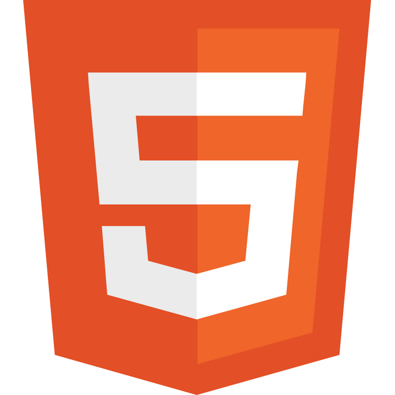
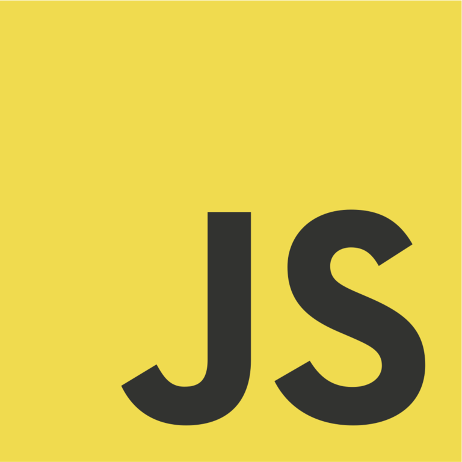
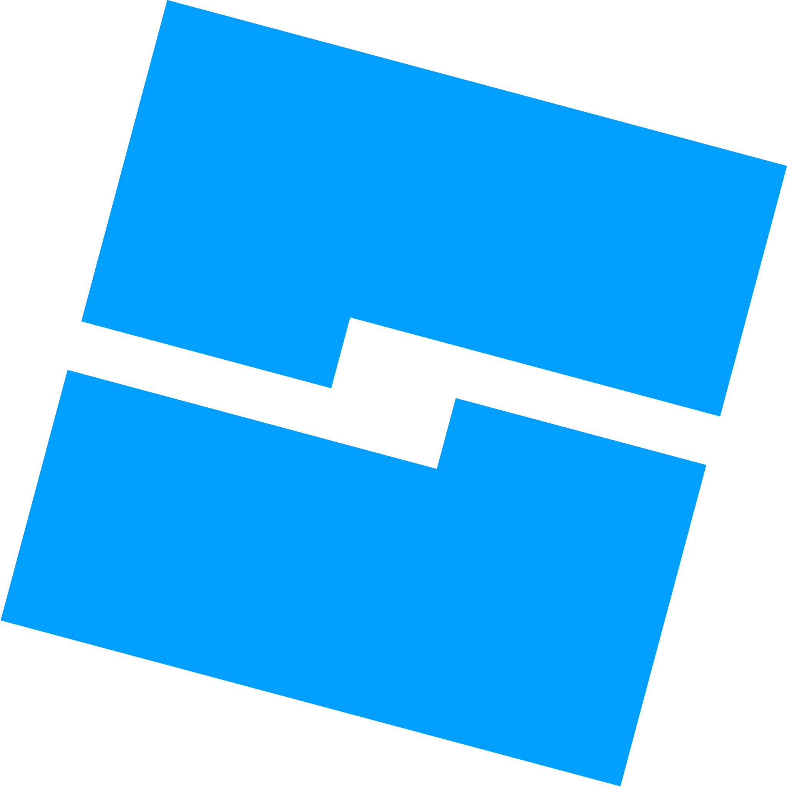
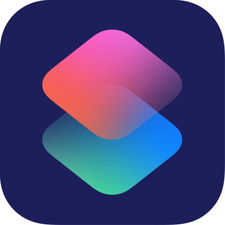

# Hi, I’m InfinityLoop (he/him/his).

## I am an indie game developer usually coding at school when I'm not supposed to.

I make games and host them on my website (https://infinityloop1.netlify.app) and my itch.io (https://infinityloopgames.itch.io).

I also sometimes make extensions for TurboWarp.

I also collaborate with @dacoder123456m to help with his sites.

## Languages known:
- HTML: 95%
- CSS: 80%
- C#: 25%
- JavaScript: 55%
- Lua: 10%
- Scratch/Turbowarp: 100%
- Apple Shortcuts: 95%

  
  
  
  
  
  
  
  

<!---
InfinityLoopGames/InfinityLoopGames is a ✨ special ✨ repository because its `README.md` (this file) appears on your GitHub profile.
You can click the Preview link to take a look at your changes.
--->
